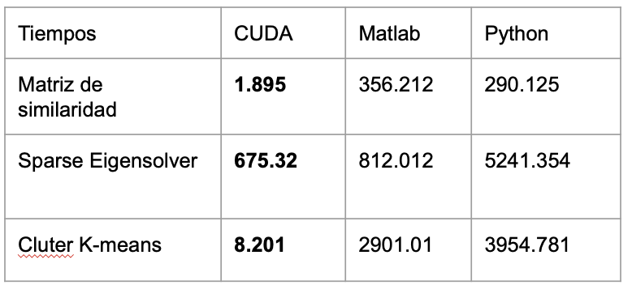
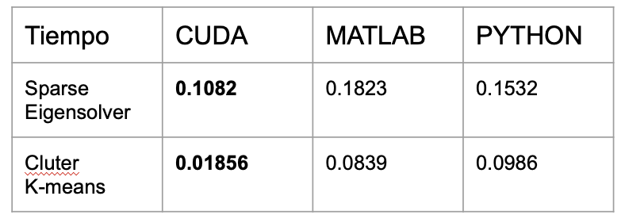
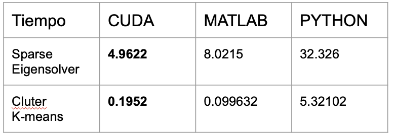
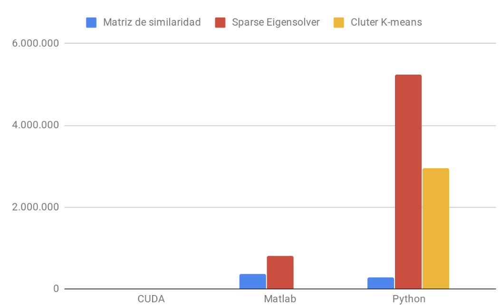
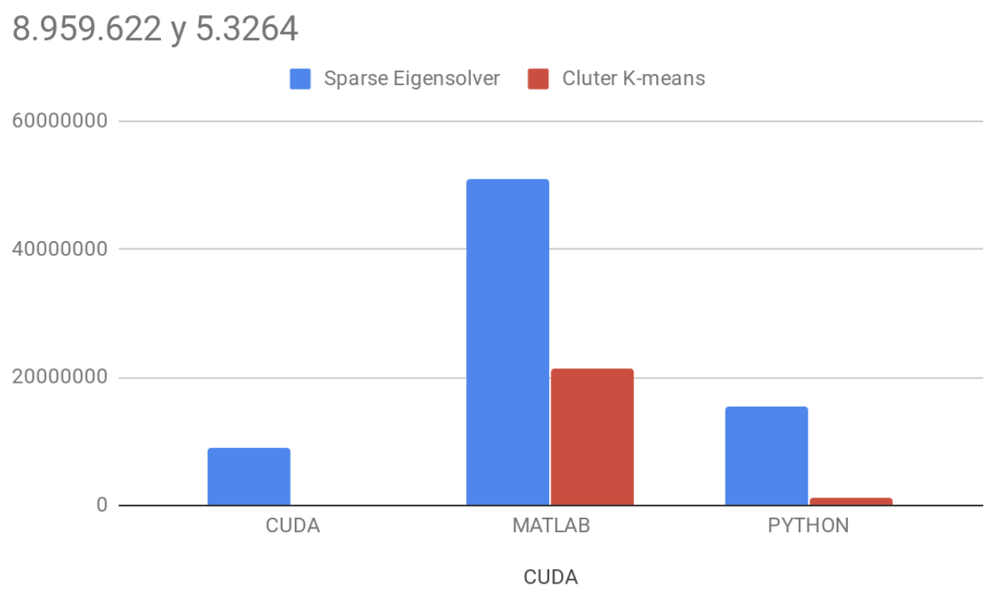

# FinalParalelos
Trabajo final de computación paralela sobre el articulo  A High Performance Implementation of Spectral Clustering on CPU-GPU Platforms en donde se explica una manera de hacer clustering utilizando cuda para un mejor desempeño.

Primeramente se hizo el experimento con el anlisis de redimiento de DTI y se obtuvo lo siguiente:

Se hizo los experimentos dados en el artículo con el dataset de FB y dio los siguientes resultados:

Aquí se ve como con cuda se tiene ventaja y tiene un mejor rendimientos por milesimas.

Despues se hizo los experimentos con un cambio en el dataset, se utilizo el dataset de Syn200 y se obtuvo lo siguiente:

Al final tenemos las graficas que demuestras el rendimiento total

